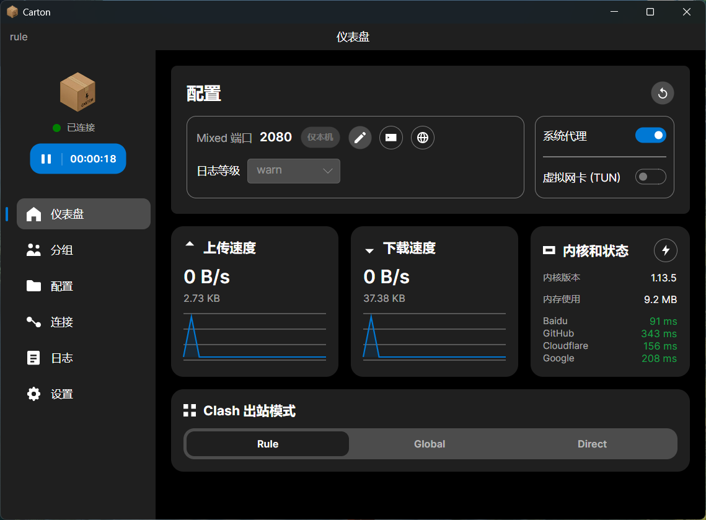
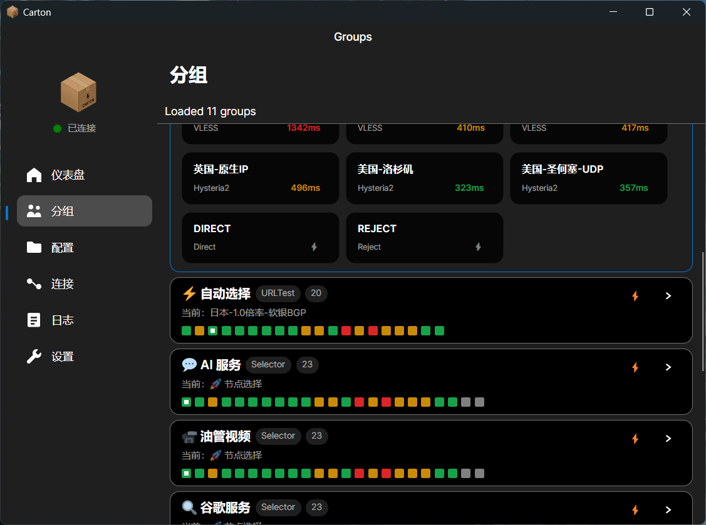
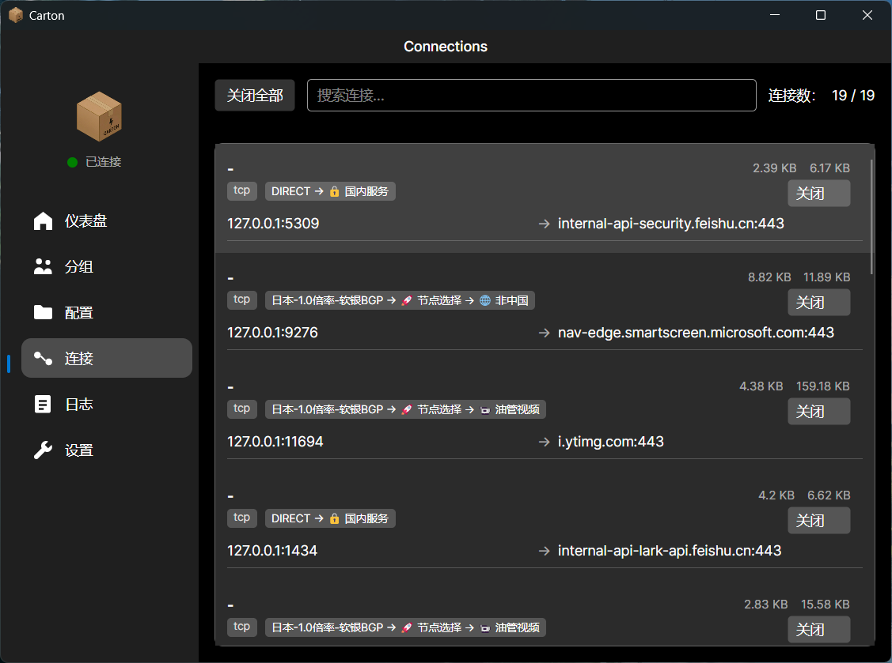
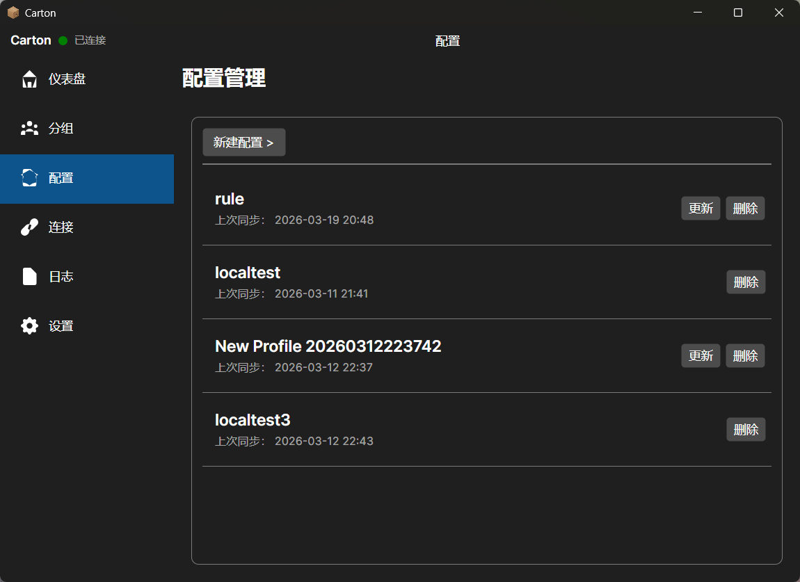

[简体中文](./README.md) | English

# carton

`carton` is a desktop client powered by `sing-box`. The project aims to stay as close as possible to the official SFM experience in interaction flow and information layout, while focusing on high performance and a few practical extra features.

The project currently targets `Windows` and `Linux`. There are no plans to publish a `macOS` version, because SFM already exists on macOS.

The project is still in an early stage, but its direction is already clear:

- Keep the experience close to official SFM to reduce migration cost
- Prioritize performance, responsiveness, and startup speed
- Start sing-box with your own config and rules, only overriding a small set of toggle-style options for convenience
- Add useful features without breaking the main workflow
- Non-Electron, non-Tauri, and non-web-tech desktop shell

> `carton` is not an official SFM client and is not affiliated with the sing-box team.

## Screenshots

| Dashboard | Groups |
| --- | --- |
|  |  |
| Connections | Profiles |
|  |  |

## Highlights

### Familiar workflow close to official SFM

- Six core pages: Dashboard, Groups, Profiles, Connections, Logs, and Settings
- Common actions such as start, stop, status check, and group switching are kept in the main workflow
- Built-in Clash API / WebUI entry to match existing usage habits

### Performance-oriented

- Built with `Avalonia` and `.NET 10`
- Non-Electron, non-Tauri, and non-web-tech desktop framework approach
- One direct motivation is that many real-world apps built on those stacks can easily start at `200MB+` memory usage
- Includes `NativeAOT` publish scripts for faster startup and lower runtime overhead
- Uses on-demand page loading and background page release/refresh control to reduce long-running resource usage

### Config and subscription management

- Create, import, and edit local configs
- Import remote subscriptions with manual update and auto-update intervals
- Save per-profile runtime options before startup
- If you do not have a `sing-box` subscription URL, you can use [`sublink-worker`](https://github.com/7Sageer/sublink-worker); it provides the online tool [`app.sublink.works`](https://app.sublink.works) to convert various subscription formats or protocol links into `sing-box` configs

### Node and group enhancements

- Read and display outbound groups
- Support node switching, latency testing, and URLTest refresh
- View and switch groups directly from the tray menu
- Optionally disconnect affected connections after node switching

### Practical extras

- System proxy toggle
- Runtime options for TUN, listen port, LAN access, and log level
- Real-time traffic, memory usage, session duration, connections, and logs
- sing-box kernel download, update, custom kernel installation, and kernel switching
- App update channels, backup export/import, and portable data directory switching
- Chinese and English UI with theme settings

## Tech Stack

- `Avalonia UI`
- `.NET 10`
- `CommunityToolkit.Mvvm`
- `sing-box`
- `Velopack`

## Development and Build

### Platforms

- `Windows`
- `Linux`

### Requirements

- `.NET 10 SDK`
- Windows NativeAOT publishing requires `Desktop development with C++` or an equivalent MSVC / Windows SDK toolchain
- If you want to generate the installer, `Velopack CLI (vpk)` is also required; `scripts\build-release-win-x64.ps1` will try to install or update it automatically

### Local build

```powershell
dotnet build carton.slnx
```

### Windows NativeAOT publish

```powershell
scripts\test-publish-win-aot.bat win-x64 Release
```

Or use the packaging script that also creates the installer:

```powershell
scripts\build-release-win-x64.bat
```

In practice:

- `scripts\test-publish-win-aot.bat` performs the NativeAOT publish only
- `scripts\build-release-win-x64.bat` calls `scripts\build-release-win-x64.ps1` and additionally creates the portable archive and Velopack installer

The repository already contains multiple runtime targets, while the current ready-to-use scripts are mainly organized around the Windows AOT build flow.

## Positioning

If you want:

- an experience that stays close to official SFM
- stronger focus on performance
- a few practical features beyond the official client

then `carton` is being built in exactly that direction.

## License

This project is released under the GNU General Public License v3.0. See [LICENSE](./LICENSE) for details.
