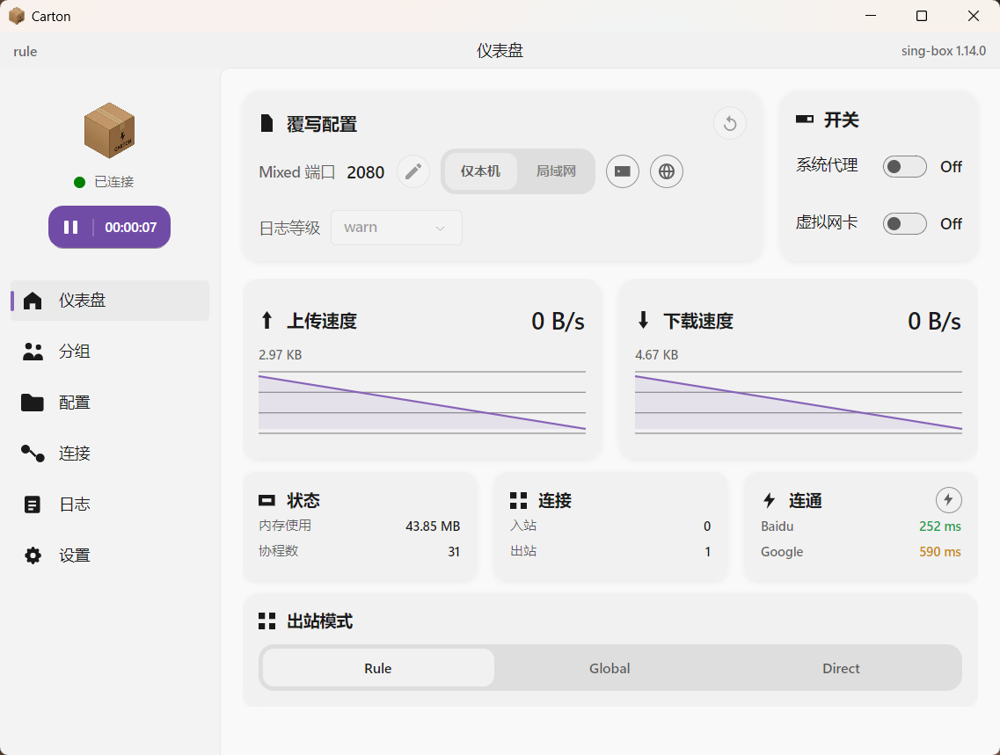
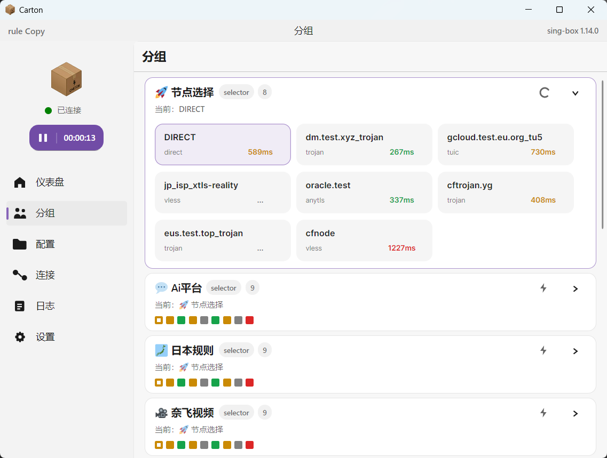
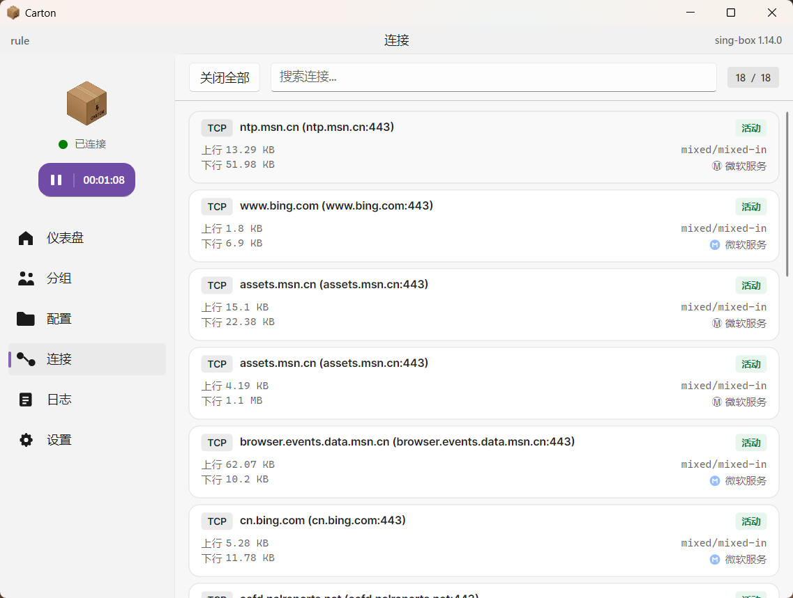
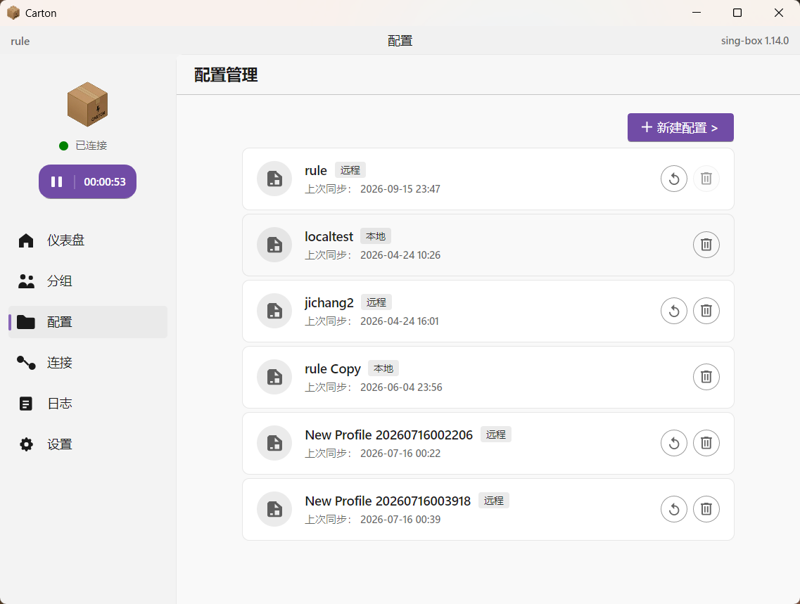

[English](./README.en.md) | 简体中文

# carton

[](https://t.me/+fwutL7igOTk3ZmFl)

`carton` 是一个基于 `sing-box` 的桌面客户端，交互和信息组织尽量贴近官方 SFM，同时更看重性能、响应速度，以及一些更实用的增强功能。

目前支持 `Windows` 和 `Linux`。暂不提供 `macOS` 版本，因为 macOS 上已经有 SFM。

项目方向：

- 尽量贴近官方 SFM 的体验，降低迁移成本
- 更看重界面响应、启动速度和长期运行时的资源占用
- 直接使用你自己的配置和规则启动 `sing-box`，只额外提供少量开关式选项
- 在不打乱主流程的前提下补上一些实用能力
- 使用非 Electron / Tauri / Web 技术栈的桌面实现，内存占用更低、性能更好

## 安装

普通用户直接到 [Releases](https://github.com/821869798/carton/releases) 下载对应平台的包：

| 平台 | 推荐文件 | 说明 |
| --- | --- | --- |
| Windows | `-win-x64-Setup.exe` | 安装版，支持应用内自动更新 |
| Windows | `-win-x64-portable.zip` | 免安装，数据保存在程序目录 |
| Ubuntu / Debian | `-linux-x64.deb` | `sudo apt install ./carton-<版本>-linux-x64.deb` |
| Fedora / openSUSE | `-linux-x64.rpm` | `sudo dnf install ./carton-<版本>-linux-x64.rpm` |
| Arch / CachyOS / EndeavourOS | AUR `carton-bin` | `yay -S carton-bin` |
| 其他发行版 | `-linux-x64.AppImage` | 免安装；Ubuntu 24.04+ 需要额外装 `libfuse2` |
| 其他发行版 | `-linux-x64-portable.tar.gz` | 解包即用，支持应用内自动更新 |

用 `.deb` / `.rpm` / AUR 安装时，应用**不会自更新**（避免覆盖 `/usr` 下的文件、避免与包管理器数据库脱节）：
应用内的"检查更新"仍然可用，检测到新版本时不再引导你去下载自更新，而是提示对应的升级方式
（AUR 直接给出 `yay -Syu`，deb/rpm 提示下载新版安装包覆盖安装）。

## 配置复写说明

`carton` 启动时不会直接整份覆盖你的 `sing-box` 配置，而是在原配置基础上生成运行时配置，只修改少量和桌面开关直接相关的内容。
这样设计是因为很多用户都很反感第三方 GUI 大面积覆盖自己已经配好的配置和规则，`carton` 会尽量少碰你原本手写或订阅生成的内容。

- `log`：只会更新 `log.level`；如果原配置没有 `log`，才会补一个最小可用的 `log` 对象
- `inbounds`：只会处理 `mixed` 和 `tun` 两类入口
- 对已有 `mixed` inbound，只更新 `listen`、`listen_port`、`set_system_proxy`，其他字段保持原样
- 对已有 `tun` inbound，优先保留原配置中的 `address`，缺失时才补上默认地址；`auto_route` 和 `strict_route` 会更新为 `true`
- 如果配置里原本没有对应的 `mixed` / `tun` inbound，运行时才会补上；如果关闭 `tun`，则会移除对应的 `tun` inbound

> `carton` 不是官方 SFM 客户端，也不隶属于 sing-box 官方团队。

## 界面预览

| Dashboard | Groups |
| --- | --- |
|  |  |
| Connections | Profiles |
|  |  |

## 主要特性

### 贴近官方 SFM 的主流程

- Dashboard / Groups / Profiles / Connections / Logs / Settings 六个核心页面
- 启动、停止、查看状态、切换分组等常用操作集中在主流程中
- 内置 Clash API / WebUI 入口，方便和现有使用习惯衔接

### 性能优先

- 基于 `Avalonia` + `.NET 10`
- 非 Electron、Tauri 和其他基于 Web 技术的桌面框架
- 很多同类方案在实际使用里，启动后内存占用很容易来到 `200MB+`
- 提供 `NativeAOT` 发布脚本，用来进一步改善启动速度和运行开销
- 页面按需加载，并对后台页面做了释放和刷新控制，减少长期运行时的资源占用

### 配置与订阅管理

- 支持本地配置创建、导入、编辑
- 支持远程订阅导入、手动更新、自动更新间隔
- 启动前可为不同配置保存独立运行参数
- 如果你没有 `sing-box` 订阅地址，可以使用 [`sublink-worker`](https://github.com/7Sageer/sublink-worker) 进行转换；它提供了 [`app.sublink.works`](https://app.sublink.works) 在线工具，可将多种订阅或协议链接转换为 `sing-box` 配置。若是机场用户，请在 `User Agent` 中输入 `clash` 或 `xray`

### 节点与分组增强

- 读取并展示 `outbound groups`
- 支持节点切换、延迟测试、URLTest 结果刷新
- 托盘菜单可直接查看和切换分组
- 可选在切换节点后自动断开受影响的连接

### 实用附加功能

- 系统代理切换
- TUN / 监听端口 / LAN 访问 / 日志级别等运行时选项
- 实时流量、内存占用、会话时长、连接列表、日志查看
- 支持 sing-box 内核下载、更新、自定义内核安装与内核切换
- 应用更新通道、备份导出/导入、便携模式数据目录切换
- 中英文界面与主题设置

## 技术栈

- `Avalonia UI`
- `.NET 10`
- `CommunityToolkit.Mvvm`
- `sing-box`
- `Velopack`

## 开发与构建

### 平台

- `Windows` 
- `Linux`

### 环境要求

- `.NET 10 SDK`
- Windows 本地调试 TUN 提权或发布包需要 `Rust toolchain`（`cargo`）
- Windows NativeAOT 发布需要安装 `Desktop development with C++` 或等效的 MSVC / Windows SDK 构建工具链
- 如需生成 Windows 安装包，还需要 `NSIS`，并确保 `makensis` 可用；GitHub Actions 会自动安装 NSIS

### 本地构建

```powershell
dotnet build carton.slnx
```

### 开发运行

```powershell
dotnet run --project src\carton.GUI\carton.GUI.csproj
```

Windows Debug 构建会在检测到 `cargo` 时自动构建并复制 `carton-helper.exe` 到 GUI 输出目录；如果未安装 Rust，应用仍可启动，但本地调试时的 Windows TUN 提权启动不可用。

### 单元测试

```powershell
dotnet test src\carton.GUI.Tests\carton.GUI.Tests.csproj
cargo test --manifest-path src\carton.Helper\Cargo.toml
```

向 `main` 的 push / PR 会通过 `.github/workflows/ci.yml` 自动跑上述构建与测试。

### Windows NativeAOT 发布

```powershell
scripts\build\test-publish-win-aot.bat win-x64 Release
```

或使用带安装包封装的脚本：

```powershell
scripts\build\build-release-win-x64.bat
```

其中：

- `scripts\build\test-publish-win-aot.bat` 只执行 NativeAOT 发布
- `scripts\build\build-release-win-x64.bat` 会执行 `scripts\build\build-release-win-x64.ps1`，并额外生成便携压缩包和 NSIS 安装包

### Linux NativeAOT 发布

```bash
./scripts/build/test-publish-linux-aot.sh linux-x64 Release
```

输出目录为 `artifacts/publish/<rid>`。

生成 `.deb` / `.rpm`（包管理器托管，应用内不自更新）：

```bash
# 先用 INSTALLER_BUILD 发布（AppImage / .deb / .rpm 共用这一份）
./scripts/build/test-publish-linux-aot.sh linux-x64 Release artifacts/publish/linux-x64-appimage INSTALLER_BUILD
# 再打包（需要 nfpm，脚本会自动下载到 artifacts/tools/）
./scripts/build/build-linux-packages.sh linux-x64 1.2.3 artifacts/publish/linux-x64-appimage
```

`linux-arm64` 同理，把 rid 换掉即可。AUR 包见 [`packaging/aur/`](./packaging/aur/README.md)。

CI 除 deb/rpm 外还会产出 `-package.tar.gz`（INSTALLER_BUILD 那一份，去掉 `carton-helper`
与便携标记），AUR 的 `carton-bin` 就是用它重打包的：portable 变体虽然也能删文件绕过，
但编译期常量 `IsPortableDistributionBuild` 修不了，设置页会多出一个在本安装方式下
不可能生效的"数据存到程序目录"选项。

### 安装包盖章（`.carton_package`）

deb / rpm / AppImage 的打包步骤，以及 AUR 的 `PKGBUILD`，都会在可执行文件旁写一个单行
`.carton_package`（内容 `deb` / `rpm` / `aur` / `appimage`），运行期由
`carton.Core.Utilities.InstallStamp` 读取。它只用于两件事：启动日志里的一行
（`[INFO] install: deb, data: /home/u/.config/Carton (non-portable)`）和更准的更新提示。

盖章**只是辅助信息**：没有它时代码会回退到"程序目录在 /usr/ 下 + 读 /etc/os-release"
的老推断（也就是盖章之前的行为），所以旧包、以及第三方重打包的包都不会退化。新增发行
格式时记得在两处保持同步：`InstallStamp.Slug()` 与打包步骤里写入的值。

仓库里已经包含多个运行时目标，现成脚本主要围绕 Windows AOT 构建流程整理。

## 项目定位

如果你更在意：

- 尽量接近官方 SFM 的体验
- 更偏性能取向的实现
- 一些官方客户端之外但又不喧宾夺主的实用功能

那么 `carton` 基本就是按这个方向来做的。

## License

本项目基于 GNU General Public License v3.0（GPL-3.0）开源，详见 [LICENSE](./LICENSE)。

### 第三方代码

本仓库内置（vendored）了以下第三方源码，其许可证与署名均随源码保留：

| 组件 | 位置 | 上游 | 许可证 |
|---|---|---|---|
| Downloader 5.9.5 | [`src/carton.Core/Downloader/`](./src/carton.Core/Downloader/) | [bezzad/Downloader](https://github.com/bezzad/Downloader) | MIT，见 [LICENSE](./src/carton.Core/Downloader/LICENSE) |

内置原因、本地改动与同步上游的步骤见 [`src/carton.Core/Downloader/README.md`](./src/carton.Core/Downloader/README.md)。
