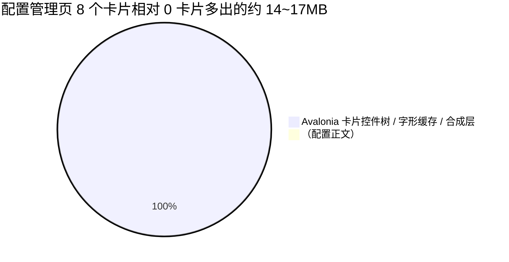

# carton 内存占用剖析与本地优化

> 合并自原先的 `MEMORY_OPTIMIZATION_REPORT.md` 与 `MEMORY_OPTIMIZATION_REPORT2.md`。
> 面向结果的短文见 [`MEMORY_OPTIMIZATION_RESULTS.md`](./MEMORY_OPTIMIZATION_RESULTS.md)。
>
> **任务管理器默认「内存」列 = 专用工作集**（Working Set - Private），不是提交大小，也不是工作集。
> 渲染后端保持 Avalonia 官方默认（Windows：`AngleEgl` 优先）。不要用强制软件渲染交差。
>
> **铁律：配置 JSON 正文平时不准进内存。** 只允许两处读盘，用完立刻丢掉：
> ① 配置管理点进去看 / 改正文；② 点启动、生成运行时配置去覆写 mixed/tun/log。
> 列表、托盘、仪表盘选配置、打开 carton，都只准用索引 / 元数据。

**更新**：2026-09-14  
**相关提交**：`9f9ae41` 及后续修正  
**环境**：Windows 11 / .NET 10 / Avalonia 11.3.18  
**复现脚本**：`scripts/memory/mem-regions.ps1`、`scripts/memory/mem-repeat.ps1`  
**分配跟踪**：`报告20260913-2337.diagsession`（约 1.9 小时 Object Allocation Tracking）

---

## 一、背景与现象

从 **0.5.2** 升到 **0.6.0** 后，内存争议主要有四条：

1. **版本基线**
   - 冷启动：0.5 约 50MB，0.6 约 80MB（多约 30MB）
   - 日常代理运行：0.5 约 100MB，0.6 约 130MB
2. **「0 个配置约 50MB，8 个配置 70MB+」——是一打开 carton，不是启动内核**
   - 测的是：进程起来、主窗口在，**sing-box 还没跑**。任务管理器「内存」列：空列表约 50MB，列表里 8 个配置约 70MB+。
   - **不要**把这 20MB 理解成「启动内核时把 8 份 JSON 读进内存做覆写」。内核没启动，配置正文就不该在内存里。
   - 合理预期：打开 carton 只加载配置**索引**（id / 名字 / 类型 / 更新时间）。点进某一条看正文、或点启动去做运行时覆写，才读那一份文件；编辑结束 / 覆写写出 runtime 文件之后，正文立刻释放。
   - 列表侧改成流式只抽元数据后，大约能再省 3~5MB；**剩下约 15MB 主要是首页 / 配置卡片视觉树，仍不是 8 份配置原文。**
3. **TLS / HTTPS 与对照软件**
   - TLS 握手和会话算不算进 carton 进程？
   - sing-box 官方、v2rayN 测速用 HTTP 还是 HTTPS？检查更新能不能避免 HTTPS？
4. **库能不能再瘦**
   - `Downloader` 能否内嵌源码并裁掉不用的面？
   - Win32 `crypt32.dll` P/Invoke 会不会比 `ProtectedData` NuGet 更省？

---

## 二、问题剖析

### 1. 「0 配置 50MB vs 8 配置 70MB+」那 20MB（打开 carton，内核未启动）

**测量点再强调一遍：** 刚打开 GUI，没有点启动。

**2026-09-14 实测复现（`scripts/memory/mem-config-timing.ps1`）。**
用真实应用，先把配置目录清空/写入，再启动读任务管理器「内存」列（专用工作集）：

| 启动页 | 配置数 | 磁盘配置总量 | 任务管理器「内存」 |
|---|---|---|---|
| 仪表盘 | 0 | 0 KB | **8.55 MB** |
| 仪表盘 | 8 | **16 MB** | **8.37 MB** |
| 配置管理 | 0 | 0 KB | 8.82 MB |
| 配置管理 | 8 | **6 KB** | **26.07 MB** |
| 配置管理 | 8 | **16 MB** | **22.60 MB** |

能读出三件事：

1. **配置正文根本没被读。** 磁盘上放 16MB 配置，打开后内存与 0 配置**零差别**（8.37 vs 8.55MB）。
2. **那多出来的 ~14~17MB 是配置卡片 UI**，与配置大小无关：同样 8 个卡片，配置从 6KB 换成 16MB，占用不变（26.07 vs 22.60MB，差异属噪声）。
3. **卡片只在配置管理页打开时才花这笔钱**；停在仪表盘时不花。

所以用户当时看到的「8 配置比 0 配置多 20MB」：**不是配置正文，是卡片控件树**。

**为什么确定没读配置：**

- 代码层：`IConfigManager.LoadConfigAsync`（返回全文）全仓库只有 **2 个调用点**——
  `ProfilesViewModel` 的「查看/编辑正文」与「分享配置」，都不在打开路径上。
- 列表层：`ProfileManager.ListAsync()` 只读 `sing-box-data.json` 元数据；`Profile` 模型
  **没有任何配置正文字段**。
- 测试层：`ProfileManagerTests.OpeningProfileList_NeverReadsConfigFileContents`
  把 8 个配置文件全部以 `FileShare.None` 独占锁住（任何读取都会抛），
  `ListAsync()` 与 `GetRuntimeOptionsAsync()` 仍全部成功；测试还先断言
  「锁住时直接 `File.ReadAllText` 确实抛异常」，防止空转通过。

那 20MB 的合理构成（已按实测修正）：



#### ① Avalonia 视觉树与卡片（约 8~10MB）

- **0 配置**：`ProfilesView` 列表空，只有占位，几乎不建卡片。
- **8 配置**：`ObservableCollection<ProfileItemViewModel>` 里 8 个 VM。每个卡片会拉出一套控件树：`Border` / `Grid` / `TextBlock` / 状态徽章 / `Button` / `MenuFlyout` / `PathIcon` 等。
- Composition 管道里每个复杂控件还有 `Visual` 节点、字形缓存（`GlyphRun`）、绑定槽。8 张卡连带弹出菜单，合成层会明显变重。

> 原稿写「Direct2D 显存约 9MB」。Avalonia 11.3 实际走 **ANGLE → D3D11**，显存也不计入任务管理器「内存」列。更准确的说法是：**卡片视觉树 + 合成层私有页**，不是一块独立的 Direct2D 显存账单。

#### ② `ProfileManager` 配置原文（约 3~5MB，已优化）

- **优化前**：`ListAsync()` 把每个配置的完整 JSON 读进内存，反序列化成 `ConfigLayout` / `RuntimeOptions`，还对每个配置跑 `EnsureConfigLayoutAsync`。
- **优化后**：`JsonDocument.ParseAsync(stream)` 流式解析，只抽 `name` / `type` / `updated_at` 等给列表。**列表阶段不再反序列化配置原文。** 用户有几十个配置时，启动阶段主要是索引，不是整表常驻。

#### ③ 首页为「当前选中项」准备的控件（约 2~3MB）——不是启动内核、不是 JSON 正文

打开 carton 时仪表盘会列出配置并标出当前选中项，绑定名字、选中态、端口开关等。
**这里不该**把该配置的 sing-box JSON 读进来做 `template` / inbound 合并。
运行时合并只应发生在用户点启动之后：读盘 → 改 mixed/tun/log → 写出 runtime 文件 → 丢掉对象树。
原先把这块写成「激活配置的运行时合并」，容易理解成「一打开就把配置正文加载了」。那是错的。

#### ④ 后台订阅检查（约 1MB）

存在多个远程订阅时，`RemoteConfigUpdateService` 会为远程配置保留检查定时器和更新上下文。量级小于卡片树，但是「有订阅才有」的固定开销。

#### ⑤ GC 堆阈值被抬高（约 3MB）

Workstation GC 会按近期分配速率调代的回收阈值。启动时加载 8 个配置产生的临时对象寿命很短，但密集分配会让 GC 把 Gen0/1/2 阈值抬高，空闲页不立刻还给 OS，工作集看起来停在 70MB+。配合后面的工作集修剪（`SetProcessWorkingSetSize`），这部分可以在低峰期还回去。

---

### 2. TLS / HTTPS：会进 carton 进程吗？别人怎么测速？

**会。** Windows 上 `HttpClient` 走 SSPI / SChannel（`schannel.dll`、`crypt32.dll`）。HTTPS 时在**当前进程**里分配会话票据、证书链验证、加解密上下文。这是未托管堆，计入工作集 / 专用工作集。所以启动后只要打过一次 HTTPS，内存会涨一截，GC 收不走那块 native 上下文。

**测速为什么仍用 HTTPS：**

| 软件 | 默认测速 |
|---|---|
| sing-box 官方 `clash_api.url_test` | HTTPS，如 `https://www.gstatic.com/generate_204` |
| v2rayN | 同样常用 `https://www.google.com/generate_204` |

纯 HTTP（80）在国内很容易被运营商缓存、劫持或塞 302，测速会把缓存页当成成功，出现假的 0~2ms。HTTPS 至少保证握手打到真实目标。

**检查更新**（GitHub Releases / Velopack）平台侧就是 TLS，不能改成纯 HTTP。

**测速端点优化：** 以前用 `https://www.google.com/favicon.ico`，要把几 KB 图片下完。现在改 **`https://www.google.com/generate_204`**：`204 No Content`，Body 为 0，只付 TLS 握手和响应头，不再为测速下图片。

---

### 3. 0.5 → 0.6 大约多出的 30MB

| 对比 | 0.5.2 | 0.6.0 | 影响 |
|---|---|---|---|
| UI | Avalonia 11.2 | Avalonia 11.3 | Composition / 字形引擎基线变高（原稿估计约 10~15MB 量级，未按脚本复现） |
| 与内核通信 | Clash REST（HTTP / WebSocket） | 原生 gRPC `StartedService` | HTTP/2 + Protobuf；冷启动若过早建 Channel，会把连接池拉起来 |
| Proto | 无（JSON） | 官方 proto 生成大量 C# | 类型元数据进 Loader 堆 |
| 配置列表 | 全量加载 | 曾全量加载 + 布局校验 | 随配置数放大；列表侧已改为元数据惰性读 |

gRPC / proto 的体积后来又裁过一刀（见第三节），但 0.6 相对 0.5 的基线抬升，主要仍是 **UI 栈 + 通信栈**，不是「多了 8 个配置文件原文」。

---

### 4. 分配跟踪：托管堆其实不大（原报告 2）

数据来自 VS「.NET 对象分配跟踪」，解包 `.diagsession`，用 TraceEvent 看约 1.58GB ETL（GC + 分配采样）。

| 指标 | 数值 |
|---|---|
| 会话时长 | ~1.9 小时（约 6800 秒） |
| 进程 Private Bytes 峰值 / 稳态 | **~240 MB** / **~213–217 MB** |
| **托管堆峰值 / 末次 GC 后** | **~33.8 MB** / **~19.8 MB** |
| 存活对象峰值 / 结尾 | ~45 万 / ~22.6 万 |
| 分配采样总量 | ~132 MB（1222 个采样点） |
| GC 次数 | **仅 9 次**（gen0=3, gen1=1, gen2=5） |

**GC 健康：** 2 小时 9 次 GC，没有分配风暴。存活对象在约 10 万～45 万之间锯齿波动（例如 3690s 冲到 44.7 万，一次 GC 落到 19.5 万），说明对象能被收走，**不是托管泄漏**。堆能回到 20MB 以下，存活数据量很小。

**和任务管理器对一下口径：**

| 列 | 空闲近期实测 | 含义 |
|---|---|---|
| **内存（默认）** | **约 20–22 MB** | 专用工作集 |
| 工作集 | 约 60 MB | 含共享 DLL 映射 |
| 提交大小 / Private Bytes | 约 180–190 MB（跟踪会话里稳态 ~215MB） | 虚拟地址预约；NVIDIA 驱动映射会撑大 |

所以：跟踪里「进程 215MB、托管堆 34MB」说的是 **提交大小 vs 托管堆**。用户看的「内存」列是专用工作集，空闲大约 20MB。早期 carton「启动约 40MB」也是这一列的量级。

**约 180MB 提交大小 − 托管堆，主要不是 C# 对象。** 原报告 2 把差额写成「Skia 位图 / 字体缓存 / GPU 离屏缓冲」。模块枚举后，NVIDIA 机器上能对上的是厂商用户态驱动映射（如 `nvwgf2umx.dll`、`nvgpucomp64.dll` + ANGLE/D3DCompiler），以**共享映射**为主，大多**不进**专用工作集。GC 预留段、线程栈、文件缓冲也占一部分提交大小。

强制 `Win32RenderingMode.Software` 能把提交大小打到约 40MB，专用工作集本来就约 20MB，对任务管理器「内存」几乎没帮助，**已撤回**。

#### 分配热点（按采样事件数）

采样：每个线程大约每分配 50KB 一次 `GCAllocationTick`；**事件数比字节数更能反映分配频率**。这是「谁在不停 new」，不是「谁常驻 20MB」。

| 类型 | 事件数 | 采样字节 | 说明 |
|---|---|---|---|
| **System.String** | 172 | ~19 MB | 字符串拼接 / 格式化 |
| System.Char[] | 59 | ~6.5 MB | 字符串内部缓冲 |
| System.Byte[] | 30 | ~4.1 MB | IO / 序列化 |
| **`<>c__DisplayClass`（闭包）** | 30 | ~3.2 MB | Lambda / 异步回调反复 new |
| ServerCompositionDrawListVisual | 30 | ~3.2 MB | Avalonia 合成层 |
| StringBuilder | 28 | ~3.0 MB | 文本拼装 |
| PointerEventArgs / RawPointerEventArgs | 20+16 | ~3.8 MB | 指针事件参数 |
| EventRoute / HitTest / StyleInstance | 各 ~15 | ~4.7 MB | 命中测试与样式 |
| DynamicResourceExpression / CompiledBinding | 18+7 | ~2.7 MB | XAML 动态资源 / 绑定 |

若只想降**托管分配速率**：少热循环 `$"..."`、热路径少闭包、输入处理节流、少在重复模板里堆 `DynamicResource`。  
这些最多减托管**分配**，对提交大小和专用工作集的空闲值影响都有限。托管堆稳态只有约 8~17MB，再抠 String/闭包性价比低。

---

## 三、落地优化

### 1. 配置列表惰性加载（`ProfileManager.cs`）

- `ListAsync()` 不再对所有配置跑 `EnsureConfigLayoutAsync` / `EnsureRuntimeOptionsAsync`。
- 流式 `JsonDocument` 只抽列表要展示的字段。
- 打开某个配置编辑 / 激活时，才加载那一份的完整布局。

### 2. gRPC 冷启动避让与停止即销毁

- 内核没起来时：50ms loopback TCP 探 API 端口，未监听则**不建** `GrpcChannel` / HTTP/2 池。
- `StopAsync` 调 `SingBoxApiClientFactory.Reset()`，拆 Channel。
- 本机 API 是单 HTTP/2 服务，`EnableMultipleHttp2Connections` 已关掉，少一套窗口和 ping。

### 3. Proto 裁剪

- `started_service.proto` 从约 773 行收到约 255~256 行，去掉 carton 用不到的 RPC / 消息。
- 生成 C# 原稿写「28161 → 8304 行」；当前树实测约 **9778 行**（`StartedService.cs` + `StartedServiceGrpc.cs`）。方向对（少加载一堆用不到的类型），行数以当前 `obj` 为准。

### 4. `ProtectedData` NuGet → `crypt32` P/Invoke（`SecretProtector.cs`）

- 去掉独立程序集加载（该 DLL 约 38KB，**省的是程序集体积/元数据，不是几十 MB**）。
- `fixed` 指针交给 DPAPI，`LocalFree` 清 native 缓冲。
- 与原先 `dpapi:` 密文兼容。
- **后续修正**：DPAPI 失败时不能 `return secret` 把明文写入偏好；改为 `TryProtect`，失败保留旧密文。
- **已回退（后续修正）**：换回 `ProtectedData` 包引用。收益与代价不成比例——省下的只是几十 KB 程序集
  元数据，却要引入 `AllowUnsafeBlocks`、手动 `LocalFree` 和手写缓冲清理；两轮 code review 都指出这个替换
  的「内存收益很可疑」。两侧都是 `CryptProtectData`（同 flag、无 optional entropy、CurrentUser），
  `dpapi:` 密文互相兼容，**已有密文无需迁移**。

### 5. 内嵌 Downloader 5.9.5 并裁面

- 不自研分片（GitHub 302 丢 Range、CDN 分片冲突都容易踩坑）。
- 源码在 `src/carton.Core/Downloader/`，MIT 署名保留在该目录 `LICENSE`。
- 删了 carton 不用的 Fluent Builder 等。
- **未触发更新时对常驻贡献接近 0。** 后续补了：`MaximumMemoryBufferBytes` 封 16MB（0 会被库当成无上限）；`DownloadService` `await using` 用完释放；不再用自定义 `HttpClient` 工厂盖掉库的 `ConnectTimeout`。

### 6. 工作集修剪（`MemoryOptimizer.cs`）

- 不改激进 GC：Workstation + 已有 `ConserveMemory=3`；另外钉死 `GC.Server=false`，防止环境变量在多核机器上打开 Server GC。
- `SetProcessWorkingSetSize(-1, -1)` + 压缩回收，在低峰把空闲页还给 OS：启动后、内核启停、窗口最小化 / 进托盘、**页面 VM 卸掉之后**。
- **必须修的 bug：** 初版 `GC.Collect(..., Aggressive, blocking: false)` 会抛 `AggressiveGC requires blocking=true`，被 `catch` 吞掉，**回收和 Trim 从未执行**。现改为合法 Aggressive、线程池、限流、请求合并。修好之后，任务管理器「内存」列才会在隐到托盘 / 卸页后掉下来。

### 7. 配置正文的加载时机（严格三问）

**问：是不是只在那两个时机才加载？** 是。

`IConfigManager.LoadConfigAsync`（读全文）全仓库只有 **2 个调用点**：

| 时机 | 位置 |
|---|---|
| ① 配置管理里点进去看 / 改正文 | `ProfilesViewModel.LoadConfigContentForEditorAsync` |
| ② 点启动，生成运行时配置去覆写 mixed/tun/log | `DashboardViewModel.BuildRuntimeConfigAsync`（流式 `JsonNode.Parse` → 写 runtime 文件） |

不在打开路径上：`ListAsync()` 只读 `sing-box-data.json` 元数据；`Profile` 模型没有正文字段；
仪表盘显示端口读的是**已持久化的 `RuntimeOptions.InboundPort`**，不重读 JSON。

已由测试锁死：`OpeningProfileList_NeverReadsConfigFileContents`
（8 个配置文件全部 `FileShare.None` 独占锁，列表与运行时选项仍正常；
并先断言「锁住时读取确实抛异常」，排除空转通过），另加真实应用 16MB 配置实测零差异。

**问：用完能立即释放吗？** 可以。

- 离开编辑 / 保存 / 切换配置：`ClearLoadedConfigContent()` 把 `ConfigContent`
  与 `_initialConfigContent` 置空，编辑器 `Text` 是 TwoWay 绑定，随之释放。
- 撤销历史：`JsonEditHistory` **只存增量**（offset + 删除文本 + 插入文本），
  不存全文副本，且有条数与字符总量双上限；外部设置文本时 `_history.Clear()`。
  所以反复编辑大配置不会累积多份全文。
- 启动覆写：`BuildRuntimeConfigAsync` 里的 `JsonNode` 是局部变量，写出 runtime 文件后
  离开作用域即可回收。

**问：那打开时多出来的内存是什么？** 是卡片 UI，不是配置正文。
见上文实测：配置管理页 8 个卡片约 +14~17MB，把配置从 6KB 换成 16MB 完全不变。

### 8. 页面按需加载（对「内存」列很关键）

连接 / 配置 / 设置 / 日志页：第一次进去才 `new` VM；离开约 1 分钟 `Dispose` 可视化树。

**日志有独立数据层，卸页不会清历史。**

```
内核 / carton 日志  →  LogStore（MainViewModel 里进程级常驻，环 800 条）
                         ↓
                    LogsViewModel（过滤、滚动、屏幕上的表）
```

人不在日志页时，`OnLogReceived` 仍写入 `LogStore`。再进日志页：`new LogsViewModel(_logStore)` → `CopySnapshotTo` → 把环里还在的画出来。超过 800 条挤掉；点清空才 `Clear()`。过滤条件会回到默认（Release 默认 Info），条目还在。

连接 / 配置没有这种进程级列表仓库，卸 VM 等于卸那一页的表。

### 9. 其它已落地

- 测速：`generate_204` 空 body。
- 连接页非激活时暂停 UI 调度。
- 分组页减少无谓刷新分配。
- Release 不再 `LogToTrace()`（只留 DEBUG）。
- Avalonia 包版本统一 11.3.18（曾出现主包 11.3.14、Diagnostics 11.3.18）。

### 测过、明确不做

| 方向 | 结论 |
|---|---|
| 强制 `Win32RenderingMode.Software` | 提交大小可到 ~40MB；专用工作集本来 ~20MB。用户不要改框架默认，已撤回。 |
| 给用户加渲染模式 | 已删。 |
| `InvariantGlobalization` | 约 2.6MB（`icu.dll`），中文排序从拼音变码位。不值。 |
| 关 Concurrent GC / RetainVM | 空闲 4 次平均全在噪声里。 |
| 按分配热点死磕 String/闭包 | 稳态托管堆太小。 |

---

## 四、修改文件对照

（`9f9ae41` 及后续修正；路径相对仓库根。）

| 文件 | 改动 |
|---|---|
| `src/carton.Core/carton.Core.csproj` | 去掉 `Downloader` 包引用（`ProtectedData` 先去掉、后已回退为 10.0.5 包引用） |
| `src/carton.Core/Services/SecretProtector.cs` | 原生 DPAPI（**后已回退**为 `ProtectedData`）；`TryProtect` |
| `src/carton.Core/Downloader/` | 内嵌 5.9.5，裁无用 API，保留 MIT `LICENSE` |
| `src/carton.Core/Protos/started_service.proto` | 裁到 carton 实际调用的 RPC |
| `src/carton.Core/Services/ProfileManager.cs` | 列表只读元数据 |
| `src/carton.Core/Services/SingBoxManager*.cs` | 端口探针、停止时 Reset、流生命周期 |
| `src/carton.Core/Services/SingBoxApi/SingBoxGrpcApiClient.cs` | 精简 proto、单 HTTP/2 连接 |
| `src/carton.Core/Services/AcceleratedFileDownloader.cs` | 16MB 缓冲上限、Dispose 下载器 |
| `src/carton.Core/Utilities/MemoryOptimizer.cs` | 合法 Aggressive + Trim，限流 |
| `src/carton.GUI/App.axaml.cs` / `Views/MainWindow.axaml.cs` | 启动后、最小化 / 托盘时修剪 |
| `src/carton.GUI/ViewModels/MainViewModel.cs` | 页面按需加载；卸页后再 Trim |
| `src/carton.GUI/ViewModels/Pages/DashboardViewModel.cs` | 测速 `generate_204` |
| `src/carton.GUI/ViewModels/Pages/ConnectionsViewModel.cs` | 非激活暂停 UI 订阅 |
| `src/carton.GUI/ViewModels/Pages/GroupsViewModel.cs` | 减少刷新分配 |
| `src/carton.GUI/carton.GUI.csproj` | `ConserveMemory=3`，`GC.Server=false` |
| `src/carton.GUI/Program.cs` | Release 不 `LogToTrace` |
| `.gitignore` | 忽略分析用 ETL / diagsession |

---

## 五、验证与未测

- `dotnet test src/carton.GUI.Tests/carton.GUI.Tests.csproj -c Release`：以当前工作区为准（原稿 263；后续测试数随用例增加）。
- 构建：`carton.Core` / `carton.GUI` 以当前 Release **0 警告 0 错误**为准。

还没按「内存」列实证的：

1. 开内核、连接很多、窗口拉满之后，专用工作集会从 ~20MB 涨到多少。
2. ReadyToRun。
3. Linux。
