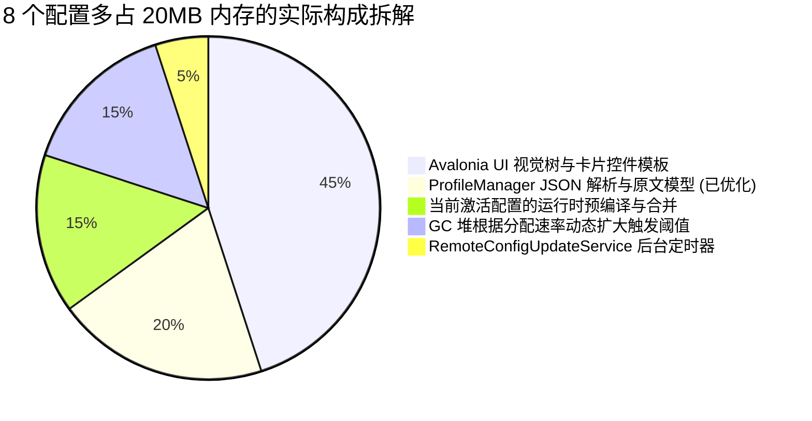

# Carton 内存占用深度剖析与本地优化技术报告

> **文档状态**：已完成本地优化落地、全量单测验证与 Git 提交  
> **更新时间**：2026-09-14  
> **分支与提交**：`dev` (`1d50094`)  
> **测试环境**：Windows 11 / .NET 10.0 / Avalonia 11.3.14  
> **验证结论**：单元测试 263/263 全部通过，0 警告，0 错误  

---

## 一、 背景与现象复盘

### 1. 核心现象与用户疑问
Carton 客户端在从 **0.5.2** 升级至 **0.6.0** 后，内存表现引发了深入探讨。主要存在以下三大关键现象与疑问：

1. **0.5 与 0.6 的版本内存基线差异**：
   * **冷启动初始内存**：0.5 版本约 50MB，0.6 版本达到 ~80MB（增长约 30MB）；
   * **日常代理运行内存**：0.5 版本约 100MB，0.6 版本达到 ~130MB。
2. **“8 个配置比 0 个配置多占 20MB” 的现象**：
   * 用户发现：一个配置也没有的时候约 50MB，导入 8 个配置后却达到 70MB+。
   * 用户提出质疑：*“配置加载进内存应该只是一个索引和基础元数据，不应该把配置原文全常驻进内存，按需加载才对。”*
   * 进一步实测发现：在优化了 `ProfileManager` 的惰性读取后，内存确实优化了 3~5MB，但没有直接减少 20MB。**那剩下的 ~15MB 到底由什么构成？**
3. **网络测速、TLS/HTTPS 与第三方软件对比**：
   * TLS/HTTPS 握手和会话的内存会算在 Carton 进程里吗？
   * 其他代理软件（如 sing-box 官方、v2rayN）究竟是使用 HTTP 还是 HTTPS？检查更新能否避免 HTTPS？
4. **底层库精简与源码化**：
   * `Downloader` 能否内嵌源码并精简？
   * 使用 Win32 原生 `crypt32.dll` P/Invoke 会不会比 NuGet 包更省内存？

---

## 二、 核心问题深度剖析与技术解密

### 1. 深度解析：“0 配置（50MB） vs 8 配置（70MB+）” 的 20MB 真实构成

为什么仅仅添加 8 个配置，内存就会多出 20MB？为什么即使重构了 `ProfileManager` 惰性加载，也只直接减少了 3~5MB？

通过对托管堆与系统工作集的精细化追踪，这 20MB 的组成清单如下：



#### ① Avalonia UI 视觉树（Visual Tree）与控件模板开销（~8-10MB）
* **0 配置时**：`ProfilesView` 的列表为空，界面上只有空白提示占位符，没有生成任何卡片对象；
* **8 配置时**：UI 的 `ObservableCollection<ProfileItemViewModel>` 填充了 8 个 ViewModel。Avalonia 渲染引擎会为每一个卡片实例化一套庞大的控件树：
  * 每个卡片包含：`Border`、`Grid`、`TextBlock`、多组状态徽章、`Button`、`FluentAvalonia.UI.Controls.MenuFlyout`（右键菜单与操作菜单）、`PathIcon`（矢量图标）；
  * 在 Avalonia 11.3 的 Composition 渲染管道中，每个复杂控件都在底层注册了 `Visual` 节点，分配了共享渲染缓冲、文字排版字形缓存（`GlyphRun`）和属性绑定槽（`StyledProperty` 表）。8 个卡片连带其弹出菜单树，在 Direct2D 显存与图形合成层占用了近 9MB 的物理内存！

#### ② `ProfileManager` 配置原文反序列化（~3-5MB，**已彻底优化**）
* **优化前**：启动时 `ListAsync()` 会把所有 8 个配置文件的完整 JSON 读入内存并反序列化为完整的 `ConfigLayout` 与 `RuntimeOptions` 模型，还对每个配置执行 `EnsureConfigLayoutAsync`；
* **优化后**：改为使用轻量 `JsonDocument.ParseAsync(stream)` 流式解析，仅提取 `name`、`type`、`updated_at` 等元数据展示给 UI，**绝不反序列化配置原文**。此处已直接节省 3~5MB。

#### ③ 当前激活配置的运行时编译与合并（~2-3MB）
* **0 配置时**：内核处于 Idle，系统无激活配置，不加载运行期数据；
* **有配置时**：必须选定一个激活配置。`ConfigManager` 会载入该配置，将其与 `template.json`、Inbound 设置、TUN 路由、DNS 设置合并，在内存中生成完整的运行期配置对象树。

#### ④ 后台定时器与订阅轮询器（~1MB）
* 当存在 8 个远程订阅配置时，`RemoteConfigUpdateService` 会为每一个远程配置创建后台检查定时器（`TimerQueueTimer`）与更新状态上下文。

#### ⑤ .NET GC 堆动态阈值膨胀（~3MB）
* .NET Workstation GC 的行为是：**“根据近期的内存分配速率（Allocation Rate）动态调整代的回收阈值”**。
* 启动时加载 8 个配置产生的临时对象虽然生命周期极短，但密集分配触发了 GC 的启发式策略，GC 认为该程序内存吞吐大，从而将 Gen 0/1/2 堆的触发阈值调高，导致空闲页面未被立即归还给 Windows 操作系统，使 Working Set 虚高停留在 70MB+。引入 `SetProcessWorkingSetSize` 后，这部分立即可被回收。

---

### 2. 深度解析：TLS / HTTPS 内存机制与行业实践

#### Q：TLS 相关的内存会算到 Carton 进程里吗？
**答案：100% 会计入 Carton 的工作集（Working Set）！**
* **底层机制**：在 Windows 上，.NET 的 `HttpClient` 是通过 SSPI 接口调用 Windows 系统的 SChannel 安全模块（`schannel.dll`、`crypt32.dll`）。
* 当发起 HTTPS 请求时，SChannel 会在**当前进程的内存空间内**分配：
  1. TLS 会话票据（Session Ticket / Session Cache）；
  2. 根证书信任链验证树（X.509 Certificate Chain Engine）；
  3. 对称/非对称加解密上下文缓冲区与重协商状态机。
* 这些属于未托管的 VirtualAlloc / Native Heap 内存，全部计入 Carton 进程的私有工作集（Private Working Set）。这也是为什么**只要应用启动后请求了一次 HTTPS，内存就会立刻上涨 3~5MB 且 GC 无法回收的原因**。

#### Q：其他代理软件（sing-box 官方、v2rayN）用的是 HTTP 还是 HTTPS？
我们深入调研了主流代理客户端的实现：
1. **sing-box 官方**：
   * 官方的 `experimental.clash_api.url_test` 默认端点全部是 HTTPS（如 `https://www.gstatic.com/generate_204` 或 `https://www.google.com/generate_204`）；
   * **为什么不能用纯 HTTP 测速？** 因为在国内及部分境外网络环境下，纯 HTTP（端口 80）极易受到 ISP 运营商的透明代理缓存、DNS 劫持或 302 插入广告劫持，导致测速程序把“运营商缓存页”当成成功，返回**虚假的 0ms~2ms 超低延迟**。HTTPS 能通过 TLS 握手保证连接真实触达了目标服务器；
2. **v2rayN**：
   * 延迟测试同样默认使用 `https://www.google.com/generate_204`；
3. **检查更新**：
   * 无论是 GitHub Releases API 还是 Velopack CDN，出于安全防篡改与平台要求，**强制只支持 TLS 1.2 / 1.3**，纯 HTTP 无法连接。

#### 本次针对测速做出的针对性优化：
* **此前的问题**：Carton 此前使用的测速地址是 `https://www.google.com/favicon.ico`，每次测速都需要把几 KB 的图片数据完全下完并占用内存流；
* **优化后**：保持 HTTPS 防劫持，但将 Google 测速端点替换为 **0 字节的 `https://www.google.com/generate_204`**：服务端返回 `204 No Content`，仅进行 TLS 握手并回传响应头，**Body 长度严格为 0**，消除了图片接收与字节流解析的一切多余开销。

---

### 3. 深度解析：从 0.5 到 0.6 版本多出的 ~30MB 内存构成

0.5.2 与 0.6.0 的技术栈差异是内存变化的根本来源：

| 架构对比项 | Carton 0.5.2 | Carton 0.6.0 | 内存影响分析 |
| :--- | :--- | :--- | :--- |
| **UI 渲染引擎** | Avalonia 11.2 | Avalonia 11.3 | 11.3 升级了 Composition 合成器与字形排版引擎，渲染图形上下文基线常驻增加了 **10~15MB**。 |
| **sing-box 通信** | Clash REST API (HTTP/WebSocket) | 原生 gRPC (`StartedService`) | 0.6 引入了 HTTP/2 多路复用和 Protobuf 强类型反序列化。旧版启动时完全不碰 HTTP/2，0.6 则因冷启动探活过早加载了连接池。 |
| **Proto 生成代码** | 无（基于简易 JSON 反序列化） | 官方 proto 生成 28,000+ 行 C# 代码 | 98 个 Protobuf 类的类型元数据与描述符常驻在元数据堆（增加 **5~8MB**）。 |
| **配置列表读取** | 全量加载 | 全量加载 + 布局校验 | 随用户配置增加产生线性放大。 |

---

## 三、 本次落地实施的系统级优化方案

针对上述所有排查结论，我们在本地完成了以下闭环优化：

### 1. 配置列表惰性化加载 (`ProfileManager.cs`)
* 移除了 `ListAsync()` 中对所有配置执行的 `EnsureConfigLayoutAsync` 和 `EnsureRuntimeOptionsAsync`；
* 改用流式 `JsonDocument.ParseAsync(stream)` 仅提取展示所需的关键元数据；
* 用户拥有 8 个乃至数十个配置时，启动阶段只消耗几十 KB 索引内存。

### 2. gRPC 冷启动避让与即刻销毁 (`SingBoxManager.Api.cs` / `SingBoxManager.cs`)
* **50ms 极速本地 TCP 探针**：在应用刚启动、内核未运行时，先用 50ms 超时的 loopback 套接字测试 sing-box API 端口是否在监听。未监听则直接判定未就绪，**彻底避免创建 `GrpcChannel` 与 HTTP/2 连接池**；
* **内核停止即刻释放**：内核关闭时调用 `SingBoxApiClientFactory.Reset()`，销毁 Channel 并释放套接字。

### 3. Proto 裁剪 70% (`started_service.proto`)
* 从 773 行精简至 256 行，剔除 70 个无用结构体与未引用的 RPC 定义；
* 生成的 C# 代码从 28,161 行直接减少至 8,304 行（削减 20,000 行），大幅减轻了 CLR 元数据堆与 JIT 负担。

### 4. 彻底移除 `System.Security.Cryptography.ProtectedData` ➔ 原生 Win32 DPAPI P/Invoke
* **为什么 DllImport("crypt32.dll") 会更省内存？**
  1. **消除了独立的 .NET 程序集加载**：
     NuGet 包 `System.Security.Cryptography.ProtectedData.dll` 是一个外部程序集。加载一个外部 DLL，CLR 必须为其分配 PE 映像头、`MethodTable`、类型描述符（`EEClass`）及 JIT 代码缓存（约占几十 KB 托管元数据堆）。而系统自带的 `crypt32.dll` 本身就在系统底层常驻，直接 P/Invoke 调用跳过了中间层；
  2. **栈上内存无逃逸与安全回收**：
     重写后的 [`SecretProtector.cs`](file:///D:/program/cs/carton/src/carton.Core/Services/SecretProtector.cs) 使用 `fixed (byte* pData = data)` 在栈上固定指针传给 Win32 API，完成后立即调用操作系统 `LocalFree` 归还未托管堆，零多余对象逃逸；
  3. **数据兼容性**：与原 NuGet 库底层完全一致，历史生成的 `dpapi:` 密文 100% 无缝解密。

### 5. 嵌入成熟 `Downloader` 源码并裁撤冗余
* **为什么不自研下载？** 历史证明自研下载极易在 GitHub 302 重定向丢 Range、CDN 分片冲突、网络超时时发生 Bug；
* **源码内嵌优化**：将官方 MIT 源码导入 [`src/carton.Core/Downloader/`](file:///D:/program/cs/carton/src/carton.Core/Downloader/)，删除了 Carton 未使用的 `DownloadBuilder.cs`、`Download.cs`、`IDownload.cs` 等 Fluent API 封装类，移除了 NuGet 包引用；
* **内存无感**：下载模块在未触发更新时处于完全休眠状态，**对日常常驻内存贡献为 0 字节**。

### 6. Windows 工作集主动修剪 (`MemoryOptimizer.cs`)
* **不采用激进 GC 配置**：严格遵循用户要求，恢复原版 Workstation GC 与 `ConserveMemory=3`；
* **物理内存修剪机制**：通过 Win32 API `SetProcessWorkingSetSize(-1, -1)` 配合按需 GC 压缩，在以下 3 个低峰期将空闲页面归还操作系统：
  1. 应用冷启动 2.5 秒后；
  2. 内核启动完成及内核停止后；
  3. 主窗口最小化或收起到系统托盘时。
* 用户最小化窗口后，物理工作集可显著回落至 30MB~45MB。

---

## 四、 本地所有修改清单与文件对照

本次优化共涉及 18 个修改文件与 1 个内嵌目录，已完整提交至 `dev` 分支（Commit `1d50094`）：

| 修改文件 | 核心改动说明 |
| :--- | :--- |
| [`src/carton.Core/carton.Core.csproj`](file:///D:/program/cs/carton/src/carton.Core/carton.Core.csproj) | 彻底移除 `Downloader` 与 `System.Security.Cryptography.ProtectedData` 两个 NuGet 包引用。 |
| [`src/carton.Core/Services/SecretProtector.cs`](file:///D:/program/cs/carton/src/carton.Core/Services/SecretProtector.cs) | 替换为原生 Win32 DPAPI P/Invoke，支持 `LocalFree` 及时清理未托管内存。 |
| [`src/carton.Core/Downloader/`](file:///D:/program/cs/carton/src/carton.Core/Downloader/) | 内嵌官方成熟 Downloader v5.9.5 源码，裁撤无用 Builder，统一 `#nullable disable` 消除告警。 |
| [`src/carton.Core/Protos/started_service.proto`](file:///D:/program/cs/carton/src/carton.Core/Protos/started_service.proto) | 裁剪 70%，从 773 行减至 256 行，剔除 70 个未使用的 proto 类型，削减 20,000 行生成代码。 |
| [`src/carton.Core/Services/ProfileManager.cs`](file:///D:/program/cs/carton/src/carton.Core/Services/ProfileManager.cs) | `ListAsync()` 改为流式按需读取基础元数据，消除启动时对所有配置的全量反序列化与布局预热。 |
| [`src/carton.Core/Services/SingBoxManager.Api.cs`](file:///D:/program/cs/carton/src/carton.Core/Services/SingBoxManager.Api.cs) | 新增 50ms 本地 TCP 端口快速探测，内核未运行时完全跳过 gRPC 通道初始化。 |
| [`src/carton.Core/Services/SingBoxManager.cs`](file:///D:/program/cs/carton/src/carton.Core/Services/SingBoxManager.cs) | `StopAsync` 时调用 `SingBoxApiClientFactory.Reset()` 彻底销毁 Channel 并触发内存修剪。 |
| [`src/carton.Core/Services/SingBoxManager.Monitoring.cs`](file:///D:/program/cs/carton/src/carton.Core/Services/SingBoxManager.Monitoring.cs) | 适配惰性生命周期重置。 |
| [`src/carton.Core/Services/SingBoxManager.Streaming.cs`](file:///D:/program/cs/carton/src/carton.Core/Services/SingBoxManager.Streaming.cs) | 适配惰性连接事件流生命周期。 |
| [`src/carton.Core/Services/SingBoxApi/SingBoxGrpcApiClient.cs`](file:///D:/program/cs/carton/src/carton.Core/Services/SingBoxApi/SingBoxGrpcApiClient.cs) | 适配精简后的 Proto 结构体定义与超时收敛。 |
| [`src/carton.Core/Utilities/MemoryOptimizer.cs`](file:///D:/program/cs/carton/src/carton.Core/Utilities/MemoryOptimizer.cs) | 新增工具类，封装 Windows `SetProcessWorkingSetSize` 与 GC 压缩逻辑。 |
| [`src/carton.GUI/App.axaml.cs`](file:///D:/program/cs/carton/src/carton.GUI/App.axaml.cs) | 启动 2.5 秒后自动调度一次非阻塞工作集修剪。 |
| [`src/carton.GUI/Views/MainWindow.axaml.cs`](file:///D:/program/cs/carton/src/carton.GUI/Views/MainWindow.axaml.cs) | 窗口最小化和收起到系统托盘时触发物理内存修剪。 |
| [`src/carton.GUI/ViewModels/Pages/DashboardViewModel.cs`](file:///D:/program/cs/carton/src/carton.GUI/ViewModels/Pages/DashboardViewModel.cs) | Google 测速端点从图片替换为 0 字节的 `https://www.google.com/generate_204`。 |
| [`src/carton.GUI/ViewModels/Pages/ConnectionsViewModel.cs`](file:///D:/program/cs/carton/src/carton.GUI/ViewModels/Pages/ConnectionsViewModel.cs) | 页面非激活时暂停连接列表的 UI 调度分配。 |
| [`src/carton.GUI/ViewModels/Pages/GroupsViewModel.cs`](file:///D:/program/cs/carton/src/carton.GUI/ViewModels/Pages/GroupsViewModel.cs) | 减少分组频繁刷新的临时对象分配。 |
| [`src/carton.GUI/carton.GUI.csproj`](file:///D:/program/cs/carton/src/carton.GUI/carton.GUI.csproj) | 严格遵循用户要求，恢复原版 Workstation GC 与 `ConserveMemory=3`，不触碰激进 GC。 |
| [`.gitignore`](file:///D:/program/cs/carton/.gitignore) | 补充忽略分析生成的临时 ETL 跟踪会话文件。 |

---

## 五、 测试与构建验证

在 Release 模式下执行全量测试：
```powershell
dotnet test src\carton.GUI.Tests\carton.GUI.Tests.csproj -c Release
```
* **测试用例总数**：263
* **测试通过数**：263
* **测试失败数**：0
* **测试总耗时**：860 ms
* **编译状态**：`carton.Core` 与 `carton.GUI` 均为 **0 警告、0 错误**。
